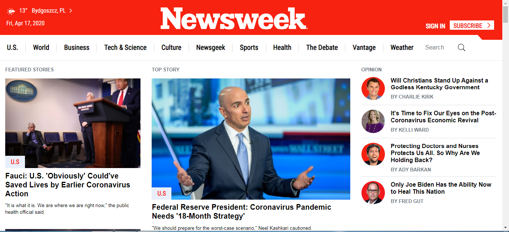

# Project: Newsweek Clone
This repository is created to clone the homepage of [newsweek.com](https://www.newsweek.com/). The main objective of this project is to learn the use of bootstrap in building the websites.

# Screenshot
This is the screenshot of my work.

# Built With
* HTML 5
* CSS 3
* Bootstrap framework
* Visual Studio Code Editor

# Live Demo
[Here](https://raw.githack.com/praz99/newsweekClone/mainpage/index.html) is the live demo of my work.

# Author
### Prajwal Thapa
* Github: [@praz99](https://github.com/praz99)

# Contributing
Contributions, issues and feature requests are welcome!
Feel free to check the [issues](https://github.com/praz99/newsweekClone/issues) page.